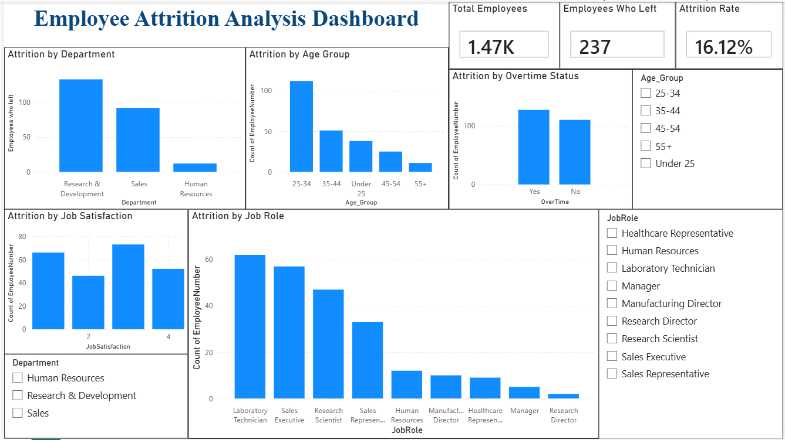

# Task 03 – Interactive Employee Attrition Dashboard

## Project Overview

This project is part of my Data Analysis Internship tasks.

The objective of this task was to create an interactive dashboard using Power BI to analyze employee attrition and identify patterns among employees who left the organization.

## Objective

The dashboard was designed to answer:

> **Why are employees leaving?**

The analysis focuses on patterns in employee attrition across department, age group, overtime status, job satisfaction, and job role.

## Dataset

**Dataset:** IBM HR Analytics Employee Attrition & Performance

The dataset contains employee-level information such as:

- Age
- Department
- Job Role
- Job Satisfaction
- OverTime
- Years at Company
- Monthly Income
- Business Travel
- Attrition

## Tools Used

- Power BI Desktop
- DAX
- IBM HR Analytics Employee Attrition dataset

## Dashboard KPIs

| KPI | Value |
|---|---:|
| Total Employees | 1,470 |
| Employees Who Left | 237 |
| Attrition Rate | 16.12% |

## Dashboard Features

The interactive dashboard contains:

- Attrition by Department
- Attrition by Age Group
- Attrition by Overtime Status
- Attrition by Job Satisfaction
- Attrition by Job Role

### Interactive Filters

Users can filter the dashboard using:

- Age Group
- Department
- Job Role

The visuals and KPI cards update dynamically when filters are selected.

## Key Observations

Based on the dashboard:

- The highest number of employees who left came from the **Research & Development** department.
- Employees working **overtime** represented a substantial portion of employees who left.
- Attrition was observed across all job satisfaction levels.
- Employees in the **25–34** age group accounted for the largest number of employees who left.
- Attrition varied across different job roles.

These observations describe patterns in the dataset and should not be interpreted as proof that a particular factor directly caused an employee to leave.

## Interactivity

The dashboard allows users to explore employee attrition patterns by selecting different:

- Age Groups
- Departments
- Job Roles

The KPI cards and charts respond automatically to the selected filters.

## Dashboard Screenshot

## Dataset Limitation

The IBM HR Analytics dataset does not contain a **Region** field.

Therefore, a Region filter was not created. Instead, the dashboard provides interactive filtering through **Age Group, Department, and Job Role**, which are available in the dataset.

## Conclusion

The Power BI dashboard provides an interactive view of employee attrition and highlights patterns across different employee characteristics.

It demonstrates the use of Power BI visuals, DAX measures, calculated columns, filters, slicers, and dashboard design to communicate data-driven insights.
